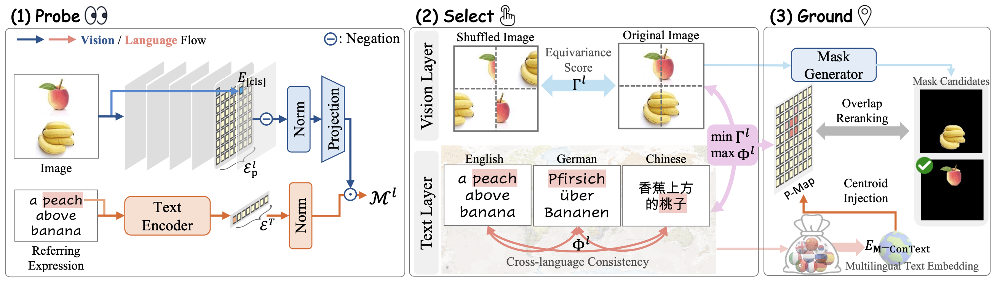

<div align="center">

<h1>Biased2Grounded</h1>

Authors:
[Na Min An*](https://namin-an.github.io/)
[Inha Kang*](https://2na-97.github.io)
[Minhyun Lee](https://scholar.google.com/citations?user=2hUlCnQAAAAJ&hl=en&oi=ao)
[Hyunjung Shim](https://scholar.google.com/citations?user=KB5XZGIAAAAJ&hl=en)

<a href="https://arxiv.org/abs/2509.23098"></a>

<p align="center" width="100%"></img></p>   

</div>

---


## Overview


Vision-Language Encoders (VLEs) are widely adopted as the backbone of **zero-shot referring image segmentation (RIS)**, enabling text-guided localization without task-specific training. Yet the conventionally used *final-layer* multimodal embeddings prioritize global semantic alignment — and the biases latent in *mid-layer* representations have remained largely unexplored.

Through layer-wise investigation, we surface two coupled consequences of this over-reliance on final-layer features:

- **Vision:** embeddings exhibit weak sensitivity to positional cues, limiting spatial grounding.
- **Language:** multilingual text embeddings form language-dependent geometric shifts within the shared representation space.


### 💡 Contributions

- **Layer-wise bias analysis** — reveals that final-layer VLE representations suppress positional sensitivity and exhibit language-dependent geometric drift in multilingual settings.
- **Mid-layer spatial map** — identifies a spatial grounding pathway in VLE mid-layers applicable for zero-shot RIS without task-specific training.
- **Mixed-language mid-layer grounding** — leveraging cross-lingual representation diversity at mid-layers yields strong spatial grounding gains (+7–8 mIoU) and improved zero-shot retrieval.

---

## Installation


```bash
apt-get install -y libgl1

uv pip install spacy git+https://github.com/openai/CLIP.git h5py gem_torch open_clip_torch==2.24.0 pydantic==2.9.1 opencv-python-headless

uv pip install torch==2.6.0+cu118 torchvision==0.21.0+cu118 --extra-index-url https://download.pytorch.org/whl/cu118

cd ./third_party/old_detectron2
uv pip install -e . --no-build-isolation

uv pip install pillow==9.5.0

uv pip install spacy==3.7.6 

python -m spacy download en_core_web_lg
```

Checkpoint: [Mask2Former](https://dl.fbaipublicfiles.com/maskformer/mask2former/coco/panoptic/maskformer2_swin_large_IN21k_384_bs16_100ep/model_final_f07440.pkl) 

---

## Dataset Structure

```
Biased2Grounded/
├── assets/
│   ├── multilingual_meta_data/
│   ├── refer_data/
│   ├── ├── images/
│   ├── ├── refcoco/
│   ├── ├── refcoco+/
│   ├── ├── refcocog/
```

---

## Experiments

```bash
# Raw Spatial Maps for CLIP, SigLIP, and SigLIP-2
notebooks/*.ipynb

# run spatial grounding evaluation
bash infer.sh
bash infer_baseline.sh 
bash infer_pmaponly.sh # p-map only ablation

# run multilingual evaluation
bash run.sh
bash run_baseline.sh
bash run_comparison.sh # final-layer centroid
```

---

## Citation

If you use this work in your research, please cite:

```bibtex
@misc{an2026blindpositionbiasedlanguage,
      title={Blind to Position, Biased in Language: Probing Mid-Layer Representational Bias in Vision-Language Encoders for Zero-Shot Language-Grounded Spatial Understanding}, 
      author={Na Min An and Inha Kang and Minhyun Lee and Hyunjung Shim},
      year={2026},
      eprint={2509.23098},
      archivePrefix={arXiv},
      primaryClass={cs.CV},
      url={https://arxiv.org/abs/2509.23098}, 
}
```
